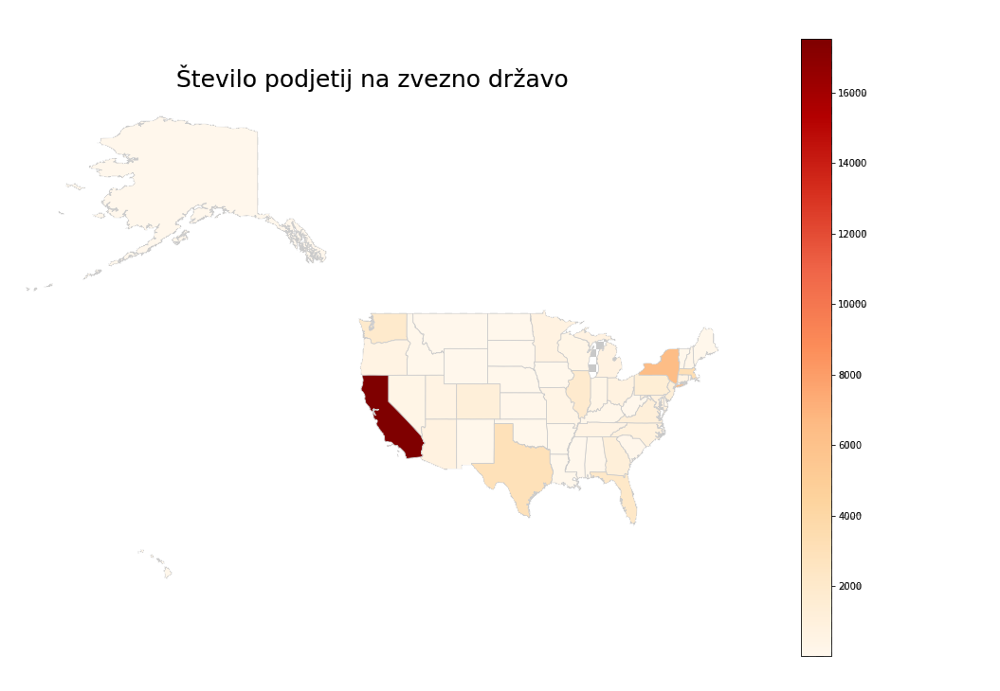
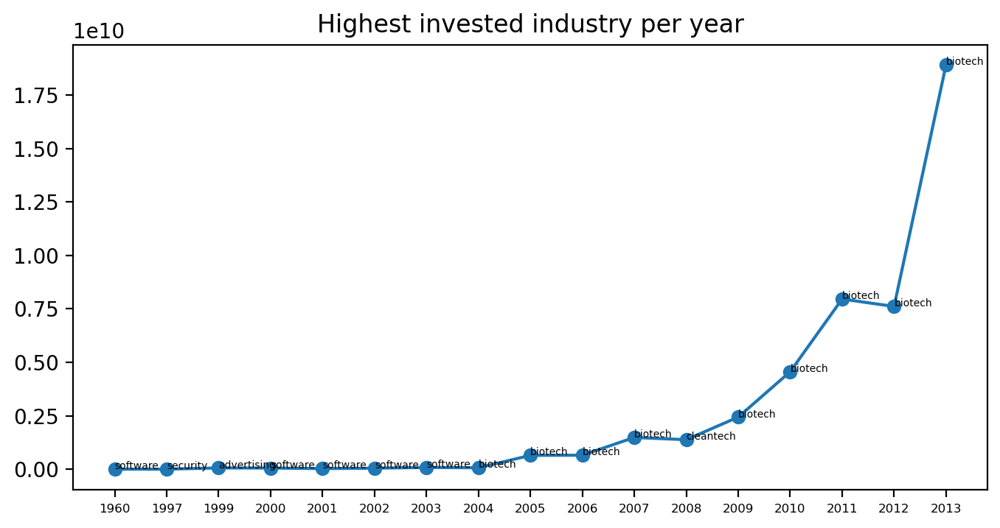

## Goals
Our general goal is to analyze the startup world. We are interested in the general state of it, what industries are performing the best, which states look the most promising, and various other data. Additionally we also want to find some success qualifiers for the invvolved companies.

## 1. Data preparation
Primariy we read all the data from csv files into pandas dataframes. Additionally we already do a small amount of preprocessing here, for example, taking out only the objects that are companies (instead of people, products...). Snippet for objects:

```python
import pandas as pd
    
def get_objects():
    return pd.read_csv("data/objects.csv", sep=",")
investments = get_investments()
companies = objects[objects["entity_type"] == "Company"]
```

We also figure out how much of the data is missing:
Total rows: 28716673
Total attributes: 145
Percentage of missing values: ~32%

32% seems like a lot, but it is scattered accross every attributte, and often doesn't signify that a value is missing, but that it doesn't exist (state_code, foor example, is missing in any row where the country isn't US).

It's important to note that we removed non US data when doing some of the below tasks. This is because the highest investitions are placed into US companies (and they also make up over 1/4 of  the data)

## 2. Basic information
Map of startup density by the US state. We can see that by far the most companies are founded in California:



Graph of companies created over time. We can see that there was an explosion of new companies created in just the last few years.


It would be also interesting to see how was this growth connected to the amount of funding received from VCs.


As we can see, the startup world has constantly grow, especially in the last few years.
## 3. Industry sectors
Grouping together sectors/categories, we can see which of them have more companies, and also more total investments. We can see that most companies are in the tech sector, which makes sense, because it's a newere and boomin industry. The highest investments are made into biotech.

```python
    count_by_category = objects.groupby("category_code").size().sort_values()
    total_fundings = funding_rounds.groupby("object_id", as_index=False)["raised_amount"].sum().sort_values("raised_amount", ascending=False)
    total_fundings_per_category = total_fundings.merge(objects, left_on="object_id", right_on="id")[["category_code", "raised_amount"]].groupby("category_code").sum()["raised_amount"].sort_values()
    total_fundings.merge(objects, left_on="object_id", right_on="id")[["category_code", "raised_amount"]].groupby(
        "category_code").sum()["raised_amount"].sort_values()
```


We try to track the investments in different sectors by year, looking at the most invested industry per year.

```python
total_fundings_by_year = funding_rounds.copy()
total_fundings_by_year = total_fundings_by_year.dropna(axis=0)
total_fundings_by_year["funded_at"] = total_fundings_by_year["funded_at"].apply(
    lambda x: datetime.strptime(str(x), "%Y-%m-%d").year)
total_fundings_by_year = total_fundings_by_year.merge(objects, left_on="object_id", right_on="id")[
    ["category_code", "raised_amount", "funded_at"]].dropna()
max_fundings_in_year = total_fundings_by_year.groupby(["funded_at", "category_code"]).sum("raised_amount")
max_fundings_in_year = max_fundings_in_year.reset_index().loc[
    max_fundings_in_year.reset_index().groupby("funded_at")["raised_amount"].idxmax()]
```


Since the sector is mostly unchanging, we instead try to find the top 5 sectors, with the highest average changes in the last few years. We once again see that biotech is at the top, and is also still rapidly growing. Behind it are once again other tech based startups (except for enterprise).

```python
def get_category_yearly_investments(cat):
    total_fundings_by_year = funding_rounds.copy()
    total_fundings_by_year = total_fundings_by_year.dropna(axis=0)
    total_fundings_by_year["funded_at"] = total_fundings_by_year["funded_at"].apply(lambda x:datetime.strptime(str(x), "%Y-%m-%d").year)
    total_fundings_by_year = total_fundings_by_year.merge(companies, left_on="object_id", right_on="id")[["category_code", "raised_amount", "funded_at"]].dropna()
    grouped = total_fundings_by_year.groupby(["category_code", "funded_at"]).sum("raised_amount")
    grouped = grouped.reset_index()[grouped.reset_index()["category_code"] == cat]
    return grouped

means = pd.DataFrame(columns=["category_code", "mean"])
for cat in pd.unique(companies["category_code"].dropna()):
    pct = get_category_yearly_investments(cat).iloc[-5:]["raised_amount"].mean()
    df = pd.DataFrame({"category_code":cat, "mean":pct}, index=[0])
    means = pd.concat([means, df])
```


We also computed some statistic based on the status of companies (operational/non-operational/...) by industry sector. Most of the data includes companies that are still running, and is mostly uniform through the industries, though companies that produce semiconductors seem more likely to be bought.


## 4. States and their connection to categories.

We mapped out which industry has the highest average investment in each state

! Manka zemljevid

We also created a quick function to check which states have the highest average investment some industry. Below is the example for web, in which we see investments are highest in Indiana.


### Based on the above two point, we conclude that biotech seems to be the most promising industry, but the recieved investments also depend on the state the company is in.

## 5. Companies

Where did employees acquire their education ?


Percentage of employees that didn't graduate: ~47%

### Predictions?

We decided to try to predict which status the company has, but ran into issues, due to lack of good attributtes?